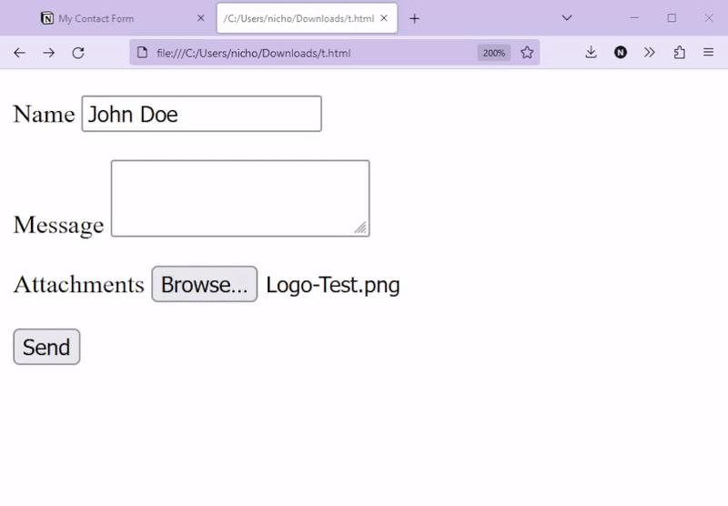
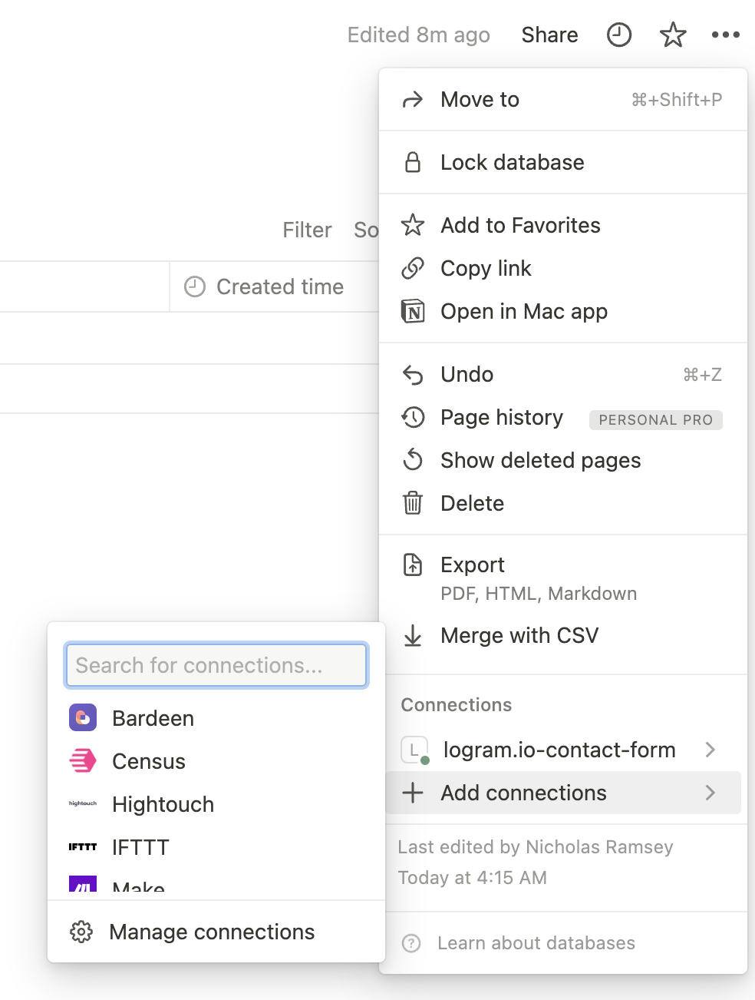

# NotiFlare Forms

A simple form backend powered by a Notion database and a Cloudflare Worker

All you need to do is create a Notion database whose columns match your form, deploy the Cloudflare Worker, and then point your form to that worker's URL.



## Quick Start

1. Create a [Notion database](#notion-database) whose columns will act as your form's fields, with the column's name being the form field's name.
2. Create a [Notion integration](#notion-integration) and connect it to your Notion database.
3. Configure and launch your Cloudflare Worker:
   
   ```bash
   git clone https://github.com/logram-llc/notion-form
   npm install

   cp wrangler.sample.toml wrangler.toml
   
   # Modify `wrangler.toml`, changing every variable under `account_id` and the `vars` section
   vim wrangler.toml

   echo "<YOUR_TOKEN>" | wrangler secret put "NOTION_INTEGRATION_TOKEN"

   # Run dev
   npx wrangler dev
   # Or deploy to prod
   npx wrangler deploy
   ```

4. Change your form's [`action`](https://developer.mozilla.org/en-US/docs/Web/HTML/Element/form#attributes_for_form_submission) attribute to point to your Cloudflare Worker (see [Setup: HTML Form](#html-form))

   ```html
   <form method="POST" action="<YOUR_CLOUDFLARE_WORKER_URL>" enctype="multipart/form-data">
   ```

Now, valid submissions to that form will appear as an entry in your Notion database.

## Environment Variables

| Variable                    | Description                                                                    | Optional | Example/Default |
|-----------------------------|--------------------------------------------------------------------------------|----------|-----------------------|
| [NOTION_INTEGRATION_TOKEN](#notion-integration)    | The Notion API token obtained from an integration in your Notion workspace.    | No       | `secret_xxx`      |
| [NOTION_DATABASE_ID](#notion-database)          | The ID of the Notion database to save entries to.                              | No       | `cebb3c9df865217d0cfd9`    |
| NOTION_REQUIRED_COLUMNS     | A comma-separated list of required columns in the Notion database.             | No      | `Name,Email Address,Phone`    |
| [R2_BUCKET_URL](#file-uploads-via-cloudflare-r2)               | Full URL of the R2 bucket used to upload files                              | Yes      |  |
| CORS_ALLOW_ORIGIN           | A comma-separated list of allowed origins for CORS                                          | Yes      | `*`, `https://logram.io,https://logram.dev`                   |
| CORS_MAX_AGE                | The maximum age (in seconds) for preflight requests in CORS.                   | Yes      | `86400`               |

## Setup

### Notion Integration


1. Go to [Notion integrations](https://www.notion.so/my-integrations) and create a new internal integration associated with a workspace you manage.

2. Under **Basic Information** > **Associated workspace**, select the workspace under which your database will be stored.

3. Under **Basic Information** > **Capabilities** > **Content Capabilities**, select only "Insert content".

4. Under **Basic Information** > **Capabilities** > **Comment Capabilities**, deselect everything.

5. Under **Basic Information** > **Capabilities** > **User Capabilities**, select "No user information".

6. Hit the **Submit** button and save the token you're given as your Notion integration ID (`NOTION_INTEGRATION_ID`).

### Notion Database

1. Create a Notion database with columns for each field in your form. Name your columns after your fields' `name` attributes. 

   For example, if you wanted to create a contact form, you might use the following columns: 
 
   - Email Address (Email)
   - Full Name (Text)
   - Message (Text)

2. Go to the full page for your database. Under the page's options, find "Add connections". Select the integration you created in [Setup: Notion Integration](#notion-integration).

   <details>
   <summary>Image</summary>
   

   </details>

3. Find the database ID in your URL. This will immediately precede the query string.

   As an example: 
   ```
   https://www.notion.so/YOUR_COMPANY/cebb3c9d8c2c4344addf865217d0cfd9?v=281abb958976417fb1abd24de0fdaf5b
   ```

   `cebb3c9d8c2c4344addf865217d0cfd9` is our `NOTION_DATABASE_ID`. 

### HTML Form

Modify the `action` attribute of your HTML form to point to your Cloudflare Worker. Or, if you prefer, handle it all through the form's submit event.

Be sure the request is sent as a POST request with a `Content-Type` of `multipart/form-data`.

```html
<form method="POST" action="<YOUR_CLOUDFLARE_WORKER_URL>" enctype="multipart/form-data">
    <p>
        <label>Name <input type="text" name="Name" /></label>
    </p>
    <p>
        <label>Message <textarea type="text" name="Message"></textarea></label>
    </p>
    <p>
        <label>Attachments <input type="file" multiple name="Attachments" /></label>
    </p>

    <button type="submit">Send</button>
</form>
```

```javascript
function onSubmit(e) {
   const form = document.querySelector("form")
   const formData = new FormData(form)

   fetch("<YOUR_CLOUDFLARE_WORKER_URL>", {
      method: "POST",
      body: formData
   })
}
```

### File Uploads via Cloudflare R2

File uploads to your Notion database are only supported through Cloudflare R2 since Notion's API [does not support direct upload](https://developers.notion.com/docs/working-with-files-and-media#uploading-files-and-media-via-the-notion-api).

1. [Create an R2 bucket](https://developers.cloudflare.com/r2/get-started/#2-create-a-bucket)
2. Bind your R2 bucket by editing your `wrangler.toml` config like so:

   ```toml
   # Uncomment and fill out `bucket_name` on this line:
   r2_buckets  = [
     { binding = "R2", bucket_name = "<YOUR_BUCKET_NAME>"}
   ]

   [vars]
   # Fill out this line:
   R2_BUCKET_URL = "https://<YOUR_ACCOUNT_ID>.r2.cloudflarestorage.com/<YOUR_BUCKET_NAME>"
   ```

### Rate Limiting via Cloudflare

See [Configuring Cloudflare Rate Limiting](https://developers.cloudflare.com/waf/rate-limiting-rules/create-account-dashboard/).

## API

### OpenAPI

[See OpenAPI schema](/docs/openapi.yaml).

### Supported Notion Column Types

| Type | Multiple Values Allowed | Description | Example(s) | 
|------|-------------------------|---------|----------------|
| Text |   No                      |         | `Hello, World!` |
| Number |  No                       |         | `10`, `99.2` |
| Select |  No                       |         | `Option 2` |
| Multi-select | Yes                         |          | `Option 1`, `Option 2` |
| Status | No                        | |  `In progress`       |
| Date |  No                       | [ISO-8601](https://en.wikipedia.org/wiki/ISO_8601) with no time component  |  `1999-02-23`   |
| Person |  Yes                       |  [User ID(s)](https://developers.notion.com/reference/user)  | `776b5a1c-731c-4689-8c11-cc900a8f3f55`   |
| Files & media | Yes                         |  [File](https://developer.mozilla.org/en-US/docs/Web/API/File) or URL. Files are uploaded to R2 and then stored. URLs are stored as-is. | `https://i.imgur.com/123.jpeg` |
| Checkbox |  No                        | | `1`, `true`, `0`, `false`  |
| URL |  No                        |  | `https://logram.io`   |
| Email | No                        |  |  `hi@logram.io`     |
| Phone | No                        |  | `479-370-0008`      |

Fields of type `Files & media` are only supported if an R2 bucket is bound to the worker ([see more](#file-uploads-via-cloudflare-r2)).

---

Made with ❤️ by [Logram](https://logram.io) 